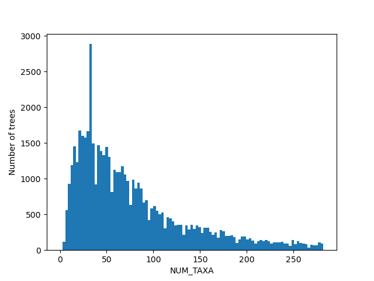
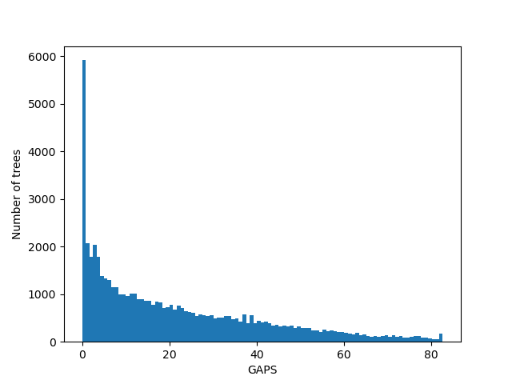

# RAxMLGrove Example Scripts

These are some example scripts using the [RAxMLGrove](https://github.com/angtft/RAxMLGrove).

Until we come up with a more clever solution (as GitHub only allows single files to be below 100 MB), the SQLite database 'latest.db' contains only the trees generated with RAxML8.
The figures below were generated using that data only. The full database can be currently downloaded from [here](https://cme.h-its.org/exelixis/material/raxmlgrove/latest_all.db).

The file 'tb_dna.db' can be used to access TreeBASE DNA datasets uploaded [here](https://github.com/angtft/TreeBASEMirror).

## Requirements
The scripts use the following packages:
- Biopython
- NumPy
- pandas
- matplotlib

They can be installed using pip:
```
pip install biopython numpy pandas matplotlib
```


## Example usage
1. To find and download data sets with a number of taxa above 100 generated using the GTR model, the following command can be used:
```
./org_script.py find -q "NUM_TAXA > 100 and MODEL = 'GTR'"
```
The script will print a subset of the trees found and ask for user input to decide whether some, or all, of the trees should be downloaded. To list all of
the trees found, without requiring the user input, the flag ”–-list” can be used.

2. To generate 10 MSAs (using [Dawg](https://github.com/reedacartwright/dawg)) with incomplete data for data sets which have a missing data rate above 80%, the following command can be used:
```
./org_script.py generate -q "MISSING_DATA_RATE != 'None' and MISSING_DATA_RATE > 0.8" --num-msas 10 --insert-matrix-gaps
```
The script will then search for data sets satisfying these conditions, randomly select 10 of them and generate MSAs using Dawg (default) for every
data set. There is a chance that the same data set will be selected multiple times. This will however, with near certainty, lead to different generated 
sequences since the sequence generators Dawg and [Seq-Gen](https://github.com/rambaut/Seq-Gen) will use different seeds for their random number generator on every execution. To set a specific 
seed use the argument "--seed s".

3. To generate 10 MSAs using data sets which are not considered outliers (i.e., number of taxa, tree diameter, branch length variance, number of patterns, percentage of
gaps, model rates and base frequencies are not outliers):
```
./org_script.py generate --num-msas 10 --filter-outliers
```

4. To print statistical information about the columns contained in RAxMLGrove:
```
./org_script.py stats
```

5. Additional arguments can be displayed with 
```
./org_script.py -h
```

Currently, when using "-q", the user needs to provide the "WHERE" part of a SQL query to find trees (which might be changed in future). The following tables and columns are available right now:
```
Table TREE
("TREE_ID", "CHAR(255)"), ("NUM_TAXA", "INT"), ("TREE_LENGTH", "FLOAT"), ("TREE_DIAMETER", "FLOAT"),
("TREE_HEIGHT", "FLOAT"), ("BRANCH_LENGTH_MEAN", "FLOAT"), ("BRANCH_LENGTH_VARIANCE", "FLOAT"),
("IS_INDELIBLE_COMPATIBLE", "INT"), ("OVERALL_NUM_ALIGNMENT_SITES", "INT"), ("OVERALL_NUM_PATTERNS", "INT"),
("OVERALL_GAPS", "FLOAT"), ("INVARIANT_SITES", "FLOAT"), ("RAXML_NG", "INT"),
("OVERALL_NUM_PARTITIONS", "INT"), ("MISSING_DATA_RATE", "FLOAT")

Table PARTITION
("MODEL", "CHAR(50)"), ("ALPHA", "FLOAT"), ("RATE_AC", "FLOAT"), ("RATE_AG", "FLOAT"), ("RATE_AT", "FLOAT"),
("RATE_CG", "FLOAT"), ("RATE_CT", "FLOAT"), ("RATE_GT", "FLOAT"), ("FREQ_A", "FLOAT"), ("FREQ_C", "FLOAT"),
("FREQ_G", "FLOAT"), ("FREQ_T", "FLOAT"), ("NUM_ALIGNMENT_SITES", "INT"), ("NUM_PATTERNS", "INT"),
("GAPS", "FLOAT"), ("INVARIANT_SITES", "FLOAT"), ("DATA_TYPE", "CHAR(50)"),
("RATE_STR", "CHAR(5000)"), ("FREQ_STR", "CHAR(2000)"), ("PARTITION_NUM", "INT"),
("STATIONARY_FREQ_STR", "CHAR(100)"), ("PROPORTION_INVARIANT_SITES_STR", "CHAR(100)"),
("AMONG_SITE_RATE_HETEROGENEITY_STR", "CHAR(100)"), ("ASCERTAINMENT_BIAS_CORRECTION_STR", "CHAR(100)"),
("CUSTOM_CHAR_TO_STATE_MAPPING", "CHAR(100)"), ("PARENT_ID", "INT")
```

For more information please refer to the [wiki](https://github.com/angtft/RAxMLGroveScripts/wiki/Usage).


## Some Figures
For the figures below we filtered the outliers for each of the displayed columns using [Tukey's fences](https://en.wikipedia.org/wiki/Outlier#Tukey's_fences).

</img></img></img></img></img></img></img></img></img></img></img></img></img></img></img></img></img>


## Citation

D. Höhler, W. Pfeiffer, V. Ioannidis, H. Stockinger, A. Stamatakis (2022)
**RAxML Grove: an empirical phylogenetic tree database**
*Bioinformatics*, 38(6):1741–1742.
[https://doi.org/10.1093/bioinformatics/btab863](https://doi.org/10.1093/bioinformatics/btab863)
