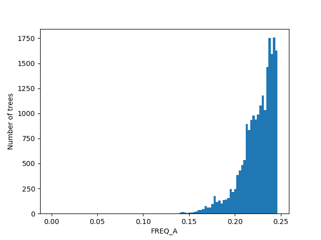

# RAxMLGrove Example Scripts

Until we come up with a more clever solution (as GitHub only allows single files to be below 100 MB), the SQLite database 'latest.db' contains only the trees generated with RAxML8.
The figures below were generated using that data only. The full database can be currently downloaded from [here](https://drive.google.com/file/d/1ucf2smX9XUdiOOgYP-GQ6COcYR-ujZaH/view?usp=sharing).


Example usage:
```
./org_script.py find -q "NUM_TAXA > 100"
```
Currently the user needs to provide the "WHERE" part of a SQL query to find trees (which might be changed in future). The following tables and columns are available right now:
```
Table TREE
("TREE_ID", "CHAR(255)"), ("NUM_TAXA", "INT"), ("TREE_LENGTH", "FLOAT"), ("TREE_DIAMETER", "FLOAT"),
("BRANCH_LENGTH_MEAN", "FLOAT"), ("BRANCH_LENGTH_VARIANCE", "FLOAT"),
("IS_INDELIBLE_COMPATIBLE", "INT"), ("OVERALL_NUM_ALIGNMENT_SITES", "INT"), ("OVERALL_NUM_PATTERNS", "INT"),
("OVERALL_GAPS", "FLOAT"), ("INVARIANT_SITES", "FLOAT"), ("RAXML_NG", "INT"),
("OVERALL_NUM_PARTITIONS", "INT")

Table PARTITION
("MODEL", "CHAR(50)"), ("ALPHA", "FLOAT"), ("RATE_AC", "FLOAT"), ("RATE_AG", "FLOAT"), ("RATE_AT", "FLOAT"),
("RATE_CG", "FLOAT"), ("RATE_CT", "FLOAT"), ("RATE_GT", "FLOAT"), ("FREQ_A", "FLOAT"), ("FREQ_C", "FLOAT"),
("FREQ_G", "FLOAT"), ("FREQ_T", "FLOAT"), ("NUM_ALIGNMENT_SITES", "INT"), ("NUM_PATTERNS", "INT"),
("GAPS", "FLOAT"), ("INVARIANT_SITES", "FLOAT"), ("DATA_TYPE", "CHAR(50)"),
("RATE_STR", "CHAR(5000)"), ("FREQ_STR", "CHAR(2000)"), ("PARTITION_NUM", "INT"),
("STATIONARY_FREQ_STR", "CHAR(100)"), ("PROPORTION_INVARIANT_SITES_STR", "CHAR(100)"),
("AMONG_SITE_RATE_HETEROGENEITY_STR", "CHAR(100)"), ("ASCERTAINMENT_BIAS_CORRECTION_STR", "CHAR(100)"),
("CUSTOM_CHAR_TO_STATE_MAPPING", "CHAR(100)"), ("PARENT_ID", "INT")
```


## Some Figures

</img></img></img></img></img></img></img></img></img></img></img></img></img></img></img></img></img>